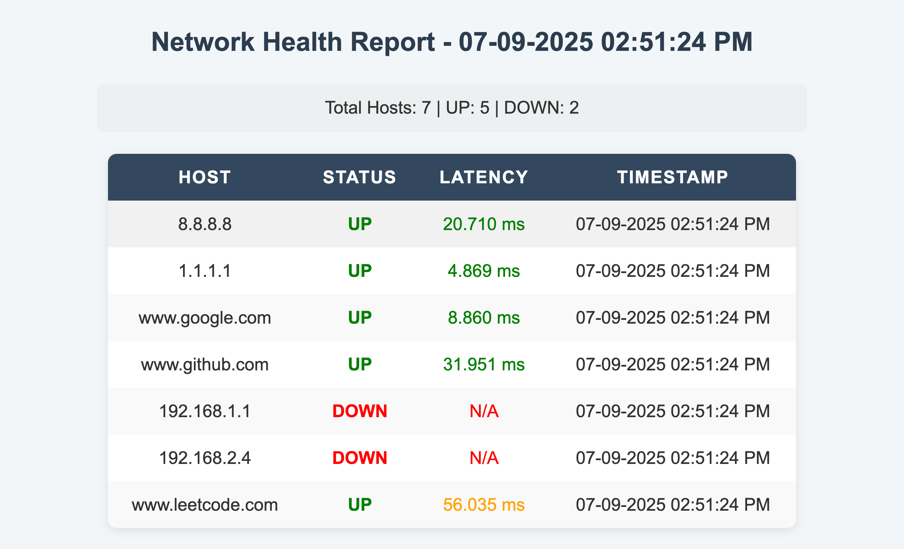

# 🖥️ Automated Network Health Monitoring Tool  

A Python-based tool to **monitor server and network availability** using automated ping tests. It generates both **CSV** and **HTML reports** with status, latency, and timestamps, making it easy to verify network health.  

---

## 🚀 Features  
- Cross-platform (Windows, Linux, Mac)  
- Pings multiple hosts from a `hosts.txt` file  
- Reports include:  
  - Host status (**UP / DOWN**)  
  - Latency in **ms** (color-coded: green/orange/red)  
  - Timestamp (12-hour format with AM/PM)  
- **Summary dashboard** in HTML: `Total Hosts | UP | DOWN`  
- Clean, styled HTML output (hover effects, table formatting)  
- Generates reports in both **CSV** and **HTML** formats  

---

## 📂 Project Structure  
```
network-health-monitor/
├── monitor.py         # Main script
├── hosts.txt          # List of hosts to monitor
├── reports/
│   ├── report.csv     # CSV output
│   └── report.html    # HTML output
```

---

## ⚙️ Setup  

1. Clone the repository:  
   ```bash
   git clone https://github.com/your-username/network-health-monitor.git
   cd network-health-monitor
   ```

2. Create `hosts.txt` with a list of IPs or domains:  
   ```
   8.8.8.8
   1.1.1.1
   example.com
   ```

3. Run the script:  
   ```bash
   python3 monitor.py
   ```

4. Check reports in the `reports/` folder:  
   - `report.csv` → Raw data  
   - `report.html` → Styled report  
   - **Live report preview:** [View Report Online](https://hamzah311.github.io/network-health-monitor/reports/report.html)


---

## 📊 Sample Output (HTML)  

### Summary  
```
Total Hosts: 3 | UP: 2 | DOWN: 1
```

### Table Example  
| Host        | Status | Latency | Timestamp           |
|-------------|--------|---------|---------------------|
| 8.8.8.8     | UP     | 24 ms   | 06-09-2025 06:42 PM |
| 1.1.1.1     | UP     | 95 ms   | 06-09-2025 06:42 PM |
| 192.168.1.1 | DOWN   | N/A     | 06-09-2025 06:42 PM |

- ✅ **Green** → fast (<50 ms)  
- 🟠 **Orange** → medium (50–150 ms)  
- 🔴 **Red** → slow/unreachable (>150 ms or N/A)  

---

## 🛠️ Tech Stack  
- **Python 3**  
- `subprocess` (ping command)  
- `csv`, `datetime`, `platform`  
- HTML + CSS for reporting  

---

## 📌 Future Improvements  
- Email alerts when hosts go **DOWN**  
- Scheduler integration (cron jobs / Task Scheduler)  
- Real-time monitoring dashboard  

## Sample Report



---

## 👨‍💻 Author  
**Hamzah Imtiaz**  
MCA Student | Aspiring Full-Stack & Automation Engineer  

